<div align="center">

# 🍽️ TasteHub — Luxury Restaurant Management System


[](https://react.dev/)
[](https://vitejs.dev/)
[](https://tailwindcss.com/)
[](https://nodejs.org/)
[](https://expressjs.com/)
[](https://www.mongodb.com/)
[](LICENSE)

<p align="center">
  <b>An enterprise-grade, full-stack MERN restaurant platform combining luxury dining presentation, real-time table reservations, digital culinary menu administration, and granular Role-Based Access Control (RBAC).</b>
</p>

---

</div>

## 📖 Executive Summary

**TasteHub** is an all-in-one culinary & hospitality management platform engineered for fine-dining restaurants and multi-role dining establishments. Built with an opulent **Obsidian Charcoal & Imperial Gold** design aesthetic, TasteHub harmoniously integrates guest-facing dining services with high-security administrative operations.

From live culinary menu curation and real-time table reservation tracking to staff scheduling and complete system audit logging, TasteHub provides an unmatched, responsive user experience backed by modern web technologies.

---

## ✨ Core Features

<table>
  <tr>
    <td width="50%" valign="top">
      <h3>🍸 Public Dining Experience</h3>
      <ul>
        <li><b>Interactive Culinary Menu</b>: Real-time category filtering (<em>Starters, Main Course, Desserts, Beverages, Salads</em>) with dynamic keyword search.</li>
        <li><b>Price Range Filtering</b>: Live price slider and sorting algorithms for effortless dish exploration.</li>
        <li><b>Curated Visual Presets</b>: High-resolution gourmet photography with smart fallback rendering.</li>
        <li><b>Smart Table Reservation Engine</b>: Guest booking system with occasion selection, party size, seating preference, and automated booking codes (<code>TH-XXXXXX</code>).</li>
      </ul>
    </td>
    <td width="50%" valign="top">
      <h3>🛡️ Security & Access Control (RBAC)</h3>
      <ul>
        <li><b>Granular Role-Based Permissions</b>: Distinct dashboards and operations for <b>Super Admin</b>, <b>Store Manager</b>, and <b>Customers</b>.</li>
        <li><b>JWT Bearer Authentication</b>: Encrypted session management with <code>bcrypt</code> password hashing.</li>
        <li><b>Brute-Force Shield</b>: IP rate limiting (<code>express-rate-limit</code>) safeguarding authentication endpoints.</li>
        <li><b>Hardened Infrastructure</b>: Helmet HTTP security headers and CORS whitelisting.</li>
      </ul>
    </td>
  </tr>
  <tr>
    <td width="50%" valign="top">
      <h3>👑 Super Admin Suite (<code>/dashboard</code>)</h3>
      <ul>
        <li><b>Executive Metrics Overview</b>: Real-time restaurant health metrics, order volumes, revenue indicators, and quick administrative actions.</li>
        <li><b>Culinary Menu Management</b>: Complete CRUD control with Multer-based disk uploads (5MB limit) and active/inactive status toggles.</li>
        <li><b>Dynamic Navigation CMS</b>: Real-time management of navigation links, routes, and role visibility mappings.</li>
        <li><b>Audit Logs</b>: Complete chronological event trail with user IDs, timestamps, and IP addresses.</li>
      </ul>
    </td>
    <td width="50%" valign="top">
      <h3>📋 Store Manager Portal (<code>/manager</code>)</h3>
      <ul>
        <li><b>Live Floor Management</b>: Real-time table reservations (<em>Confirmed, Seated, Pending, Cancelled</em>) with instant status toggles.</li>
        <li><b>Team & Shift Rosters</b>: Employee directory, shift assignment, contact cards, and employment status management.</li>
        <li><b>Business Intelligence</b>: Category sales breakdown, peak dining hour analysis, and customer retention metrics.</li>
        <li><b>Manager Profile</b>: Individual profile, credentials, and password management.</li>
      </ul>
    </td>
  </tr>
</table>

---

## 🔑 Demo Accounts

The project includes an automated database seeder (`node seed.js`) preconfigured with role-based testing credentials:

| Role | Credentials | Access Privileges |
| :--- | :--- | :--- |
|  | **Email:** `admin@tastehub.com`<br/>**Password:** `password123` | **Full Authority**: Analytics, Menu CRUD, CMS, Role Management, User Directory, System Audit Logs |
|  | **Email:** `manager@tastehub.com`<br/>**Password:** `password123` | **Operations**: Dining Floor, Team Rosters, Reservation Statuses, Shift Analytics, Walk-in Bookings |
|  | **Email:** `user@tastehub.com`<br/>**Password:** `password123` | **Public & Guest**: Menu Explorer, Table Booking, Personal Inquiries |

> [!TIP]
> Run `node seed.js` in the `backend/` directory to instantly populate these demo accounts and initial roles.

---

## 🏛️ System Architecture

```mermaid
flowchart LR
    classDef client fill:#1E1E1E,stroke:#D4A373,stroke-width:2px,color:#FAF7F2;
    classDef server fill:#231E1B,stroke:#8B5E3C,stroke-width:2px,color:#FAF7F2;
    classDef db fill:#141414,stroke:#47A248,stroke-width:2px,color:#FAF7F2;

    subgraph Client ["🖥️ CLIENT LAYER (React 19)"]
        direction TB
        UI["React 19 + Vite 8<br/>Tailwind CSS v4"]
        Router["React Router v7<br/>(Public & Dashboard Routes)"]
        Guard["ProtectedRoute<br/>(RBAC Access Gate)"]
        Axios["Axios Interceptor<br/>(Bearer Token Injection)"]
        UI --> Router --> Guard --> Axios
    end

    subgraph Backend ["⚙️ BACKEND LAYER (Express 5)"]
        direction TB
        Security["Security Middleware<br/>(Helmet & Rate Limit)"]
        AuthMiddleware["JWT Authentication<br/>& Role Verification"]
        Controllers["REST Controllers<br/>(Auth, Menu, Manager, Admin)"]
        Multer["Multer Storage Engine<br/>(/public/uploads)"]
        Security --> AuthMiddleware --> Controllers
        Controllers --> Multer
    end

    subgraph Data ["🗄️ DATA LAYER (MongoDB)"]
        direction TB
        Atlas[("MongoDB Database")]
        Schemas["Mongoose 9 Models<br/>(Users, Menus, Bookings, Logs)"]
        Atlas --- Schemas
    end

    Axios ==>|HTTP / JSON Requests| Security
    Controllers ==>|Mongoose Queries| Atlas

    class UI,Router,Guard,Axios client;
    class Security,AuthMiddleware,Controllers,Multer server;
    class Atlas,Schemas db;
```



---

## 🛠️ Tech Stack & Ecosystem

<div align="center">

| Area | Technologies | Purpose |
| :--- | :--- | :--- |
| **Frontend Framework** | `React 19.2`, `Vite 8.0` | Ultra-fast client-side rendering & rapid HMR development |
| **Styling & Icons** | `Tailwind CSS v4`, `Lucide React` | Luxury utility-first tokens, responsive layouts & modern icon set |
| **Routing & SEO** | `React Router DOM v7`, `React Helmet` | Client-side routing, protected guards & dynamic document meta |
| **Feedback System** | `React Hot Toast` | Lightweight, non-intrusive toast notifications |
| **Backend Runtime** | `Node.js 18+`, `Express.js 5.2` | High-throughput asynchronous REST API architecture |
| **Database & ODM** | `MongoDB`, `Mongoose 9.5` | Document-oriented data storage with schema validation |
| **Authentication** | `JSON Web Tokens (JWT)`, `Bcrypt` | Stateless Bearer token auth & salted password hashing |
| **File Handling** | `Multer 2.3` | Multipart form-data processing with disk storage for dish imagery |
| **API Protection** | `Helmet 8.3`, `Express Rate Limit` | HTTP header security hardening & brute-force mitigation |

</div>

---

## 📂 Repository Layout

```bash
restaurant-app/
├── backend/
│   ├── config/db.js              # MongoDB connection & error handlers
│   ├── controllers/              # REST controller logic
│   │   ├── adminController.js    # Statistics, audit logs & admin profile
│   │   ├── authController.js     # User registration and JWT login
│   │   ├── managerController.js  # Team rosters, shift analytics & bookings
│   │   ├── navMenuController.js  # Dynamic navigation CMS
│   │   ├── roleController.js     # RBAC roles & menu permission mappings
│   │   └── userController.js     # Staff & user account management
│   ├── middleware/               # Auth verification & RBAC guards
│   ├── models/                   # Mongoose data schemas
│   ├── public/uploads/           # Multer uploaded dish media
│   ├── routes/                   # API route definitions
│   ├── seed.js                   # Automated database seeder
│   ├── server.js                 # Express server bootstrap
│   └── package.json
│
├── frontend/
│   ├── src/
│   │   ├── components/
│   │   │   ├── admin/            # Super Admin UI modules
│   │   │   ├── manager/          # Store Manager UI modules
│   │   │   ├── FeaturedMenu.jsx  # Curated culinary showcase
│   │   │   ├── Navbar.jsx        # Responsive navigation with auth states
│   │   │   └── ProtectedRoute.jsx# Client-side RBAC guard
│   │   ├── pages/                # Main route views (Menu, Forms, Portals)
│   │   ├── services/api.js       # Centralized Axios client
│   │   ├── utils/imageUtils.js   # Image resolver & curated presets
│   │   ├── App.jsx               # Route definitions & global providers
│   │   └── index.css             # Tailwind tokens & global styling
│   └── package.json
│
├── assets/                       # Documentation banners & visual assets
└── README.md                     # Project documentation
```

---

## ⚡ Quick Start Guide

### Prerequisites
* [Node.js](https://nodejs.org/) (`v18.0.0` or higher)
* [npm](https://www.npmjs.com/) (`v9.x` or higher)
* [MongoDB](https://www.mongodb.com/) (Local instance or [MongoDB Atlas](https://www.mongodb.com/atlas))

---

### 1️⃣ Clone & Navigate
```bash
git clone https://github.com/Shubhashissahu/restaurant-app.git
cd restaurant-app
```

### 2️⃣ Backend Configuration & Startup
```bash
# Enter backend directory
cd backend

# Install dependencies
npm install

# Create environment file (.env)
cat <<EOF > .env
PORT=5000
MONGO_URI=mongodb://localhost:27017/restaurant-app
JWT_SECRET=your_super_secret_jwt_key_here
CLIENT_URL=http://localhost:5173
EOF

# Seed initial roles and demo credentials
node seed.js

# Launch backend in development mode
npm run dev
```
*Backend API service starts on `http://localhost:5000`.*

### 3️⃣ Frontend Setup & Launch
Open a second terminal window:
```bash
# Enter frontend directory
cd frontend

# Install dependencies
npm install

# (Optional) Set custom API URL in .env
echo "VITE_API_URL=http://localhost:5000/api" > .env

# Start Vite dev server
npm run dev
```
*Frontend application launches at `http://localhost:5173`.*

---

## 📡 API Reference

<details>
<summary><b>🔍 Click to expand the Full RESTful API Specification (35+ Endpoints)</b></summary>
<br/>

### 🔐 Authentication (`/api/auth`)
| Method | Endpoint | Description | Access |
| :--- | :--- | :--- | :--- |
| `POST` | `/api/auth/register` | Register new user account | Public |
| `POST` | `/api/auth/login` | Authenticate user & receive JWT Bearer token | Public (Rate Limited) |

### 🥗 Culinary Menu (`/api/menu`)
| Method | Endpoint | Description | Access |
| :--- | :--- | :--- | :--- |
| `GET` | `/api/menu` | Fetch all menu items (Supports `?minPrice=` & `?maxPrice=`) | Public |
| `POST` | `/api/menu` | Add new culinary dish to menu | Admin / Authenticated |
| `POST` | `/api/menu/upload` | Upload dish photo to server disk storage (5MB max) | Admin / Authenticated |
| `PUT` | `/api/menu/:id` | Update dish details, price, or image | Admin / Authenticated |
| `DELETE`| `/api/menu/:id` | Remove a dish from the menu | Super Admin |

### 📅 Reservations & Consumers (`/api/consumers`)
| Method | Endpoint | Description | Access |
| :--- | :--- | :--- | :--- |
| `POST` | `/api/consumers` | Create table reservation (Generates booking code) | Public |
| `GET` | `/api/consumers` | Retrieve all guest reservations and inquiries | Manager / Admin |
| `PUT` | `/api/consumers/:id` | Modify reservation details or guest counts | Manager / Admin |
| `DELETE`| `/api/consumers/:id` | Cancel/delete a guest reservation | Manager / Admin |

### 📋 Store Manager Operations (`/api/manager`)
| Method | Endpoint | Description | Access |
| :--- | :--- | :--- | :--- |
| `GET` | `/api/manager/reports/stats` | Retrieve revenue and dining operational statistics | Manager / Admin |
| `GET` | `/api/manager/reservations` | Fetch real-time dining room reservations | Manager / Admin |
| `POST` | `/api/manager/reservations` | Manually log a dining room walk-in or phone booking | Manager / Admin |
| `PUT` | `/api/manager/reservations/:id`| Update reservation table status | Manager / Admin |
| `DELETE`| `/api/manager/reservations/:id`| Remove reservation | Manager / Admin |
| `GET` | `/api/manager/team` | Fetch employee roster and active shifts | Manager / Admin |
| `POST` | `/api/manager/team` | Add a new team member | Manager / Admin |
| `PUT` | `/api/manager/team/:id` | Edit team member details | Manager / Admin |
| `PATCH`| `/api/manager/team/:id/status` | Toggle employee active/inactive status | Manager / Admin |
| `GET` | `/api/manager/profile` | Retrieve manager profile | Manager |
| `PUT` | `/api/manager/profile` | Update manager profile details & password | Manager |

### 👑 Super Admin Analytics & Security (`/api/admin`)
| Method | Endpoint | Description | Access |
| :--- | :--- | :--- | :--- |
| `GET` | `/api/admin/stats` | Fetch aggregate system analytics | Super Admin |
| `GET` | `/api/admin/audit-logs` | Retrieve system-wide action audit trail | Super Admin |
| `GET` | `/api/admin/profile` | Retrieve admin profile information | Super Admin |
| `PUT` | `/api/admin/profile` | Update admin personal details and password | Super Admin |

### 👥 Staff & User Management (`/api/users`)
| Method | Endpoint | Description | Access |
| :--- | :--- | :--- | :--- |
| `GET` | `/api/users` | List all system accounts and their roles | Super Admin |
| `POST` | `/api/users` | Create a new staff or administrative user | Super Admin |
| `PUT` | `/api/users/:id` | Update staff details or role assignment | Super Admin |
| `PATCH`| `/api/users/:id/status` | Toggle user active/deactivated state | Super Admin |

### 🔒 Roles & Permissions Matrix (`/api/roles`)
| Method | Endpoint | Description | Access |
| :--- | :--- | :--- | :--- |
| `GET` | `/api/roles` | List all system roles | Public / Authenticated |
| `POST` | `/api/roles` | Create a new custom role | Super Admin |
| `PUT` | `/api/roles/:id` | Update role metadata | Super Admin |
| `DELETE`| `/api/roles/:id` | Delete a role | Super Admin |
| `GET` | `/api/roles/:id/permissions` | Get menu access permissions for a role | Super Admin |
| `PUT` | `/api/roles/:id/permissions` | Update menu access permissions for a role | Super Admin |

### 🧭 Navigation CMS (`/api/nav-menu`)
| Method | Endpoint | Description | Access |
| :--- | :--- | :--- | :--- |
| `GET` | `/api/nav-menu/my-menu` | Fetch navigation items for currently logged-in user | Authenticated |
| `GET` | `/api/nav-menu` | List all registered navigation items | Super Admin |
| `POST` | `/api/nav-menu` | Add a new navigation entry | Super Admin |
| `PUT` | `/api/nav-menu/:id` | Update navigation route or label | Super Admin |
| `DELETE`| `/api/nav-menu/:id` | Delete navigation entry | Super Admin |

</details>

---

---

## 🚀 Roadmap

- [ ] **Payment Gateways**: Stripe & Razorpay integration for online reservations & deposits.
- [ ] **Live WebSockets**: Instant kitchen display ticket updates & floor table status changes.
- [ ] **Automated Alerts**: Email & SMS booking confirmations via SendGrid / Twilio.
- [ ] **Cloud Storage**: Cloudinary / AWS S3 media pipeline for dish photos.
- [ ] **Multi-Branch Support**: Multi-tenant franchise configuration for restaurant chains.
- [ ] **Containerization**: Dockerfile and Docker Compose setup for one-click deployment.

---

## 🤝 Contributing

Contributions are always welcome! If you'd like to improve TasteHub:

1. **Fork** the repository
2. **Create** your feature branch (`git checkout -b feature/AmazingFeature`)
3. **Commit** your changes (`git commit -m 'Add some AmazingFeature'`)
4. **Push** to the branch (`git push origin feature/AmazingFeature`)
5. **Open** a Pull Request

---

## 📄 License

This project is licensed under the **MIT License** — see the [LICENSE](LICENSE) file for details.

---

<div align="center">
  <b>TasteHub — Elevating Culinary & Hospitality Management</b><br>
  Built with passion using the MERN Stack. Star ⭐ this repository if you find it valuable!
</div>
